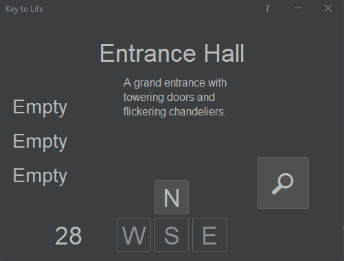
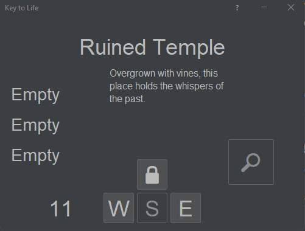
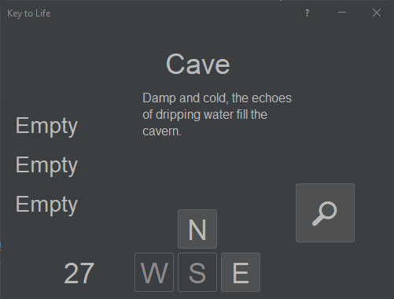
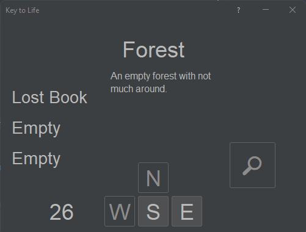
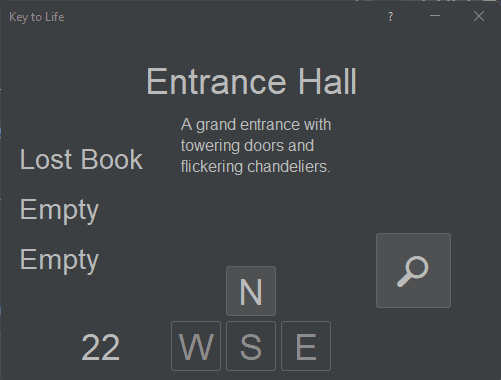
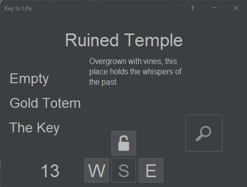
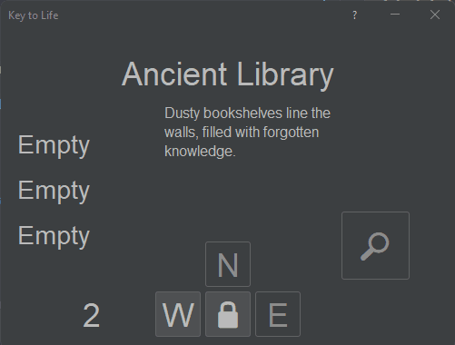
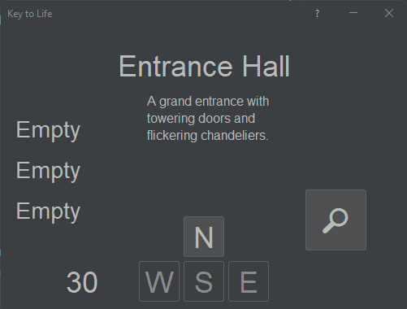
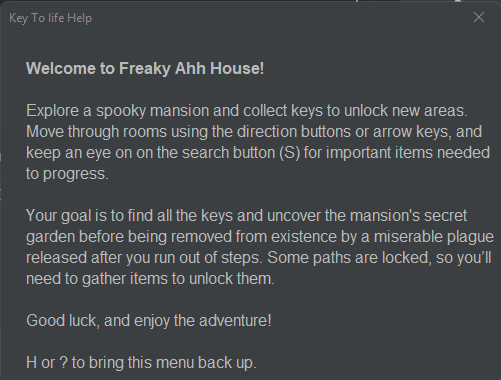
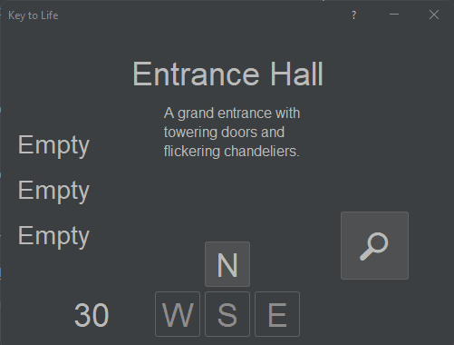

# Results of Testing

The test results show the actual outcome of the testing, following the [Test Plan](test-plan.md).

---

## Valid Movement - Move North from Entrance

Successfully moved from "Entrance Hall" to "Woodland Mansion" when pressing North.

### Test Data Used

Start in "Entrance Hall", press **North (N)**.

### Test Result

Room updated correctly. `clicks` increased by 1. UI direction label updated.

---

## Invalid Movement - Attempt to Move North from Ruined Temple Without Key

Correctly blocked from entering locked room.

### Test Data Used

Set room to "Ruined Temple", `hasKey3` = false. Press **North (N)**.

### Test Result

Dialog appeared: "You need a gold key." Room did not change. `clicks` unchanged.

---

## Boundary Test - Maximum Moves

Test prevented movement after reaching move limit.

### Test Data Used

Set `clicks` = 0. Attempted move.

### Test Result

No move occurred. Dialog warned about game loss. `clicks` stayed at 0.

---

## Valid Item Pickup - Search Room for Key

Successfully picked up key from valid room.

### Test Data Used

Room = "Cave", press **Search**.

### Test Result

Dialog: "You found a key!" `hasKey1` set to true. Room no longer has key.

---

## Invalid Search - Search Room With No Items

Handled empty room search without issue.

### Test Data Used

Room = "Forest", press **Search**.

### Test Result

No item added. Dialog: "Nothing found." No errors.

---

## Valid Compass Pickup - Display Compass Indicator

Compass successfully picked up and UI updated.

### Test Data Used

Room = "Entrance Hall", press **Search**.

### Test Result

`hasCompass` = true. Direction UI now visible. Compass hint active.

---

## Valid Win Condition - Reach Final Room With Key

Game ended successfully when final room reached with key.

### Test Data Used

Collected all final key. Entered final room.

### Test Result

Win message displayed. Buttons disabled. Player could not move further.

---

## Game Lock - Try to Move After Game Over

Player prevented from moving after Death.

### Test Data Used

After death, tried to move.

### Test Result

No response. UI disabled as expected and game closed.

---

## Valid Multiple Key Pickups

Able to collect all three keys.

### Test Data Used

Visited key rooms and collected each key.

### Test Result

Inventory tracked all keys correctly. Each pickup triggered once. Movement unlocked accordingly.

---

## Invalid Action - Try to Search Same Room Again After Pickup

No duplicate key given on second search.

### Test Data Used

Searched room twice after key taken.

### Test Result

Second search said: "Room is empty." No change to state. Program stable.

---

## Valid inputs

This test checks that all keyboard and mouse inputs work

### Test Data To Use

Press all available keys and press all buttons

### Test Result

all keys had a valid action and were reliable

---